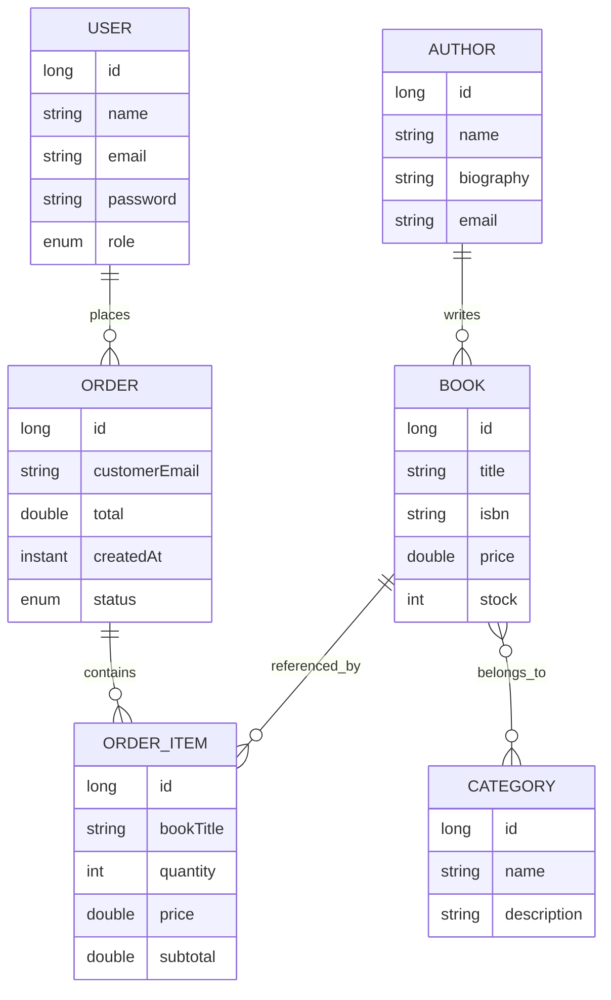

# bookstore-api

API REST de gestion de libreria en linea construida con Spring Boot, Spring Security, JWT, Spring Data JPA y H2.

## Requisitos

- Java 17 o superior
- Maven 3.8 o superior

## Ejecucion local

```bash
./mvnw spring-boot:run
```

En Windows:

```bash
mvnw.cmd spring-boot:run
```

La API queda disponible en:

```text
http://localhost:8080/api/v1
```

Consola H2:

```text
http://localhost:8080/api/v1/h2-console
```

Swagger UI:

```text
http://localhost:8080/api/v1/swagger-ui/index.html
```

OpenAPI JSON:

```text
http://localhost:8080/api/v1/v3/api-docs
```

JDBC URL:

```text
jdbc:h2:mem:bookstoredb
```

## Configuracion JWT

La clave JWT se puede configurar con variable de entorno:

```bash
JWT_SECRET=una_clave_larga_y_segura_para_firmar_tokens
```

Si no se define, el proyecto usa una clave local por defecto para desarrollo.

## Autenticacion

Registro:

```http
POST /api/v1/auth/register
Content-Type: application/json

{
  "name": "Admin",
  "email": "admin@example.com",
  "password": "password123",
  "role": "ROLE_ADMIN"
}
```

Login:

```http
POST /api/v1/auth/login
Content-Type: application/json

{
  "email": "admin@example.com",
  "password": "password123"
}
```

Usar el token devuelto en rutas protegidas:

```http
Authorization: Bearer <token>
```

## Endpoints principales

- `POST /auth/register`: publico.
- `POST /auth/login`: publico.
- `GET /books`: publico, soporta `page`, `size`, `author` y `category`.
- `POST /books`, `PUT /books/{id}`, `DELETE /books/{id}`: solo `ROLE_ADMIN`.
- `GET /authors`, `GET /authors/{id}`, `GET /authors/{id}/books`: autenticado.
- `POST /authors`, `PUT /authors/{id}`, `DELETE /authors/{id}`: solo `ROLE_ADMIN`.
- `GET /categories`, `GET /categories/{id}`, `GET /categories/{id}/books`: autenticado.
- `POST /categories`, `PUT /categories/{id}`, `DELETE /categories/{id}`: solo `ROLE_ADMIN`.
- `POST /orders`: solo `ROLE_USER`.
- `GET /orders/my`: solo `ROLE_USER`.
- `GET /orders`, `GET /orders/{id}`, `PATCH /orders/{id}/status`, `DELETE /orders/{id}`: solo `ROLE_ADMIN`.

## Contrato de respuesta

Exito:

```json
{
  "status": "success",
  "code": 200,
  "message": "Operacion completada",
  "data": {},
  "timestamp": "2026-04-22T00:00:00Z"
}
```

Error:

```json
{
  "status": "error",
  "code": 404,
  "message": "Book with id 99 not found",
  "errors": ["Book with id 99 not found"],
  "timestamp": "2026-04-22T00:00:00Z",
  "path": "/api/v1/books/99"
}
```

## Diagrama ER


